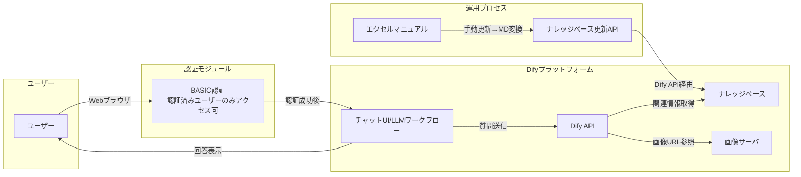

## 基本設計

このシステムは、社内・社外のスタッフが利用できるサポートチャットボットです。Difyをベースに開発し、以下の機能を提供します。

-   **FAQ検索機能**: 自然文またはキーワードによる質問に対応し、関連する手順や説明をまとめて提示します。
-   **マニュアル画像参照機能**: 最新マニュアル内の画像を回答に組み込み、適切な箇所にインライン表示します。
-   **マニュアル更新連動機能**: 手動同期によりマニュアル更新を反映し、1時間以内にチャットボットに反映します。
-   **ログイン機能**: BASIC認証などの簡易な認証方式で、認証済みのユーザーのみがチャットボットを利用できます。

### システム構成

Difyをベースに、以下の構成要素でシステムを構築します。

1.  **Difyプラットフォーム**:
    -   コアとなるLLMアプリケーションプラットフォーム。
    -   ワークフロー、モデル管理、プロンプトIDEなどの機能を利用。
    -   Gemini 2.0 FlashまたはGemini 1.5 ProをLLMとして利用。
2.  **ナレッジベース**:
    -   エクセルで管理されたマニュアルをマークダウン形式に変換して格納。
    -   DifyのRAG（Retrieval-Augmented Generation）機能で利用。
3.  **画像サーバ**:
    -   マニュアル内の画像を格納し、URLで参照可能にする。
4.  **認証モジュール**:
    -   BASIC認証などの簡易な認証方式でユーザー認証を行う。
5.  **API**:
    -   マニュアル更新時にナレッジベースを更新するためのAPI。
    -   DifyのAPIを利用。

### 機能詳細

#### FAQ検索機能

-   ユーザーが入力した質問をDifyのAPIに送信。
-   DifyのRAG機能でナレッジベースから関連情報を検索。
-   検索結果とLLMによる回答を組み合わせて、ユーザーに提示。
-   質問キーワードのサジェスト機能は、Difyの機能またはカスタム実装で実現。

#### マニュアル画像参照機能

-   回答テキスト内の画像参照箇所を特定。
-   画像サーバから該当画像のURLを取得。
-   回答テキスト内に画像をインライン表示可能な形式で挿入。

#### マニュアル更新連動機能

-   マニュアル更新は手動で実施。
-   エクセルマニュアルをマークダウン形式に変換。
-   DifyのAPIを利用してナレッジベースを更新。
-   更新後1時間以内にチャットボットに反映。

#### ログイン機能

-   BASIC認証などの簡易な認証方式でユーザー認証。
-   認証済みのユーザーのみチャットボットを利用可能。

### 非機能要件

-   **パフォーマンス**: 問い合わせに対して3秒以内に初回回答。同時アクセス20～30ユーザーを想定。
-   **信頼性・保守性**: マニュアル更新から1時間以内にナレッジ反映。
-   **セキュリティ**: 社外ネットワークからのアクセスも許可。ログイン必須による第三者利用制限。
-   **コスト**: LLMはGemini 2.0 FlashまたはGemini 1.5 Proの無料枠を活用。

### 運用・保守手順

1.  担当者がエクセルマニュアルを更新。
2.  マニュアルの内容をマークダウンに変換。
3.  DifyのAPIでマニュアルをナレッジベースに反映。
4.  1時間以内にチャットボットが更新内容を参照可能になることを確認。

### Difyの利用

-   Difyのフォーク版をベースに開発。
-   Difyのワークフロー機能を利用して、FAQ検索、画像参照、回答生成の処理を実装。
-   DifyのAPIを利用して、ナレッジベースの更新、ユーザー認証、チャットボットとの連携を行う。
-   Difyのモデル管理機能を利用して、LLMの選択と設定を行う。

### その他

-   Difyのドキュメントを参考に、詳細な設定や実装を行う。
-   必要に応じて、Difyの機能を拡張するカスタムモジュールを開発する。

### 今後の拡張

-   ユーザーからのフィードバックを収集し、チャットボットの回答精度を向上させる。
-   より高度な認証方式（SSOなど）を導入する。
-   多言語対応を検討する。